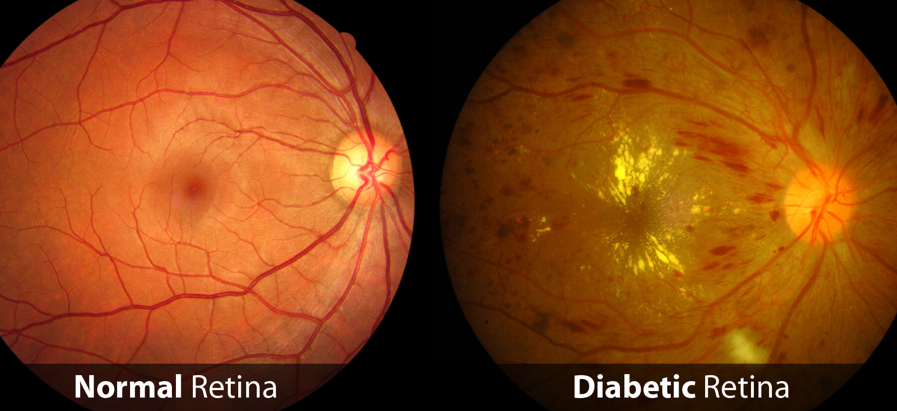
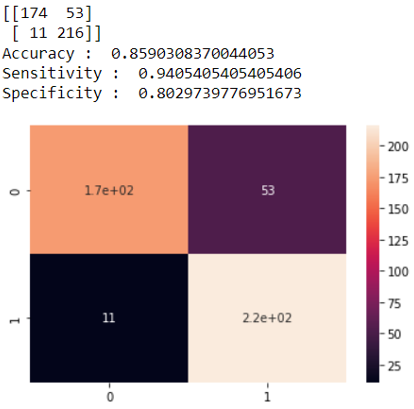

# diabetic_retinopathy
Diabetic retinopathy is caused by high blood sugar due to diabetes. Over time, having too much sugar in your blood can damage your retina — the part of your eye that detects light and sends signals to your brain through a nerve in the back of your eye (optic nerve). Diabetes damages blood vessels all over the body.

## Description
In this project we use from stare dataset and preprocess the pictures to extract features with **Convolutional Neural Networks** and send them to machine learning algorithms like **KNN**, **AdaBoost**, **Classification And Regression Trees**, **Logistic Regression** and **SVM** to predict normal and diabetic retina.

## Results
at the end we have best result with **Logistic Regression** algorithm to predict, binary result, normal and diabetic retina.

